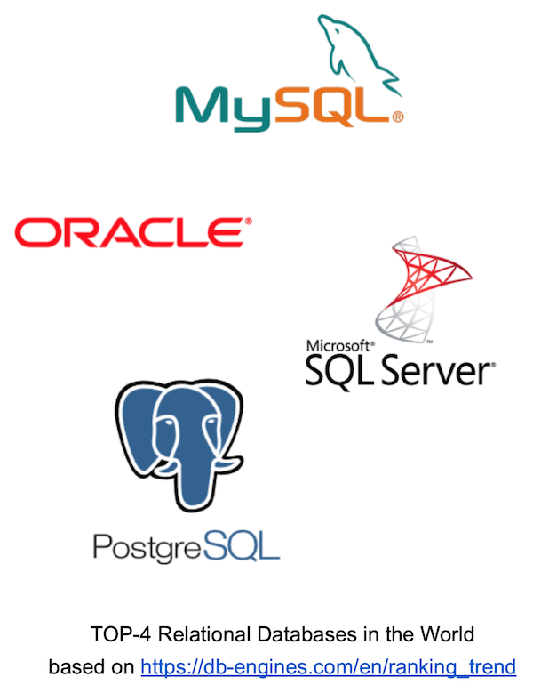
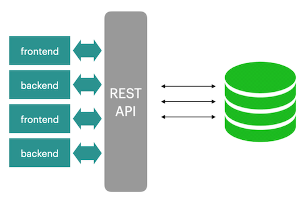
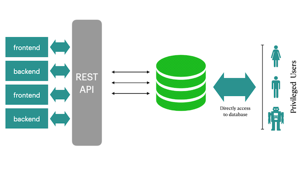

# Day 09 - Piscine SQL

## _RDBMS is not just a tables_

Resume: Today you will see how to create and use functional blocks in Databases

## Contents

1. [Chapter I](#chapter-i) \
    1.1. [Preamble](#preamble)
2. [Chapter II](#chapter-ii) \
    2.1. [General Rules](#general-rules)
3. [Chapter III](#chapter-iii) \
    3.1. [Rules of the day](#rules-of-the-day)  
4. [Chapter IV](#chapter-iv) \
    4.1. [Exercise 00 - Audit of incoming inserts](#exercise-00-audit-of-incoming-inserts)  
5. [Chapter V](#chapter-v) \
    5.1. [Exercise 01 - Audit of incoming updates](#exercise-01-audit-of-incoming-updates)  
6. [Chapter VI](#chapter-vi) \
    6.1. [Exercise 02 - Audit of incoming deletes](#exercise-02-audit-of-incoming-deletes)  
7. [Chapter VII](#chapter-vii) \
    7.1. [Exercise 03 - Generic Audit](#exercise-03-generic-audit)  
8. [Chapter VIII](#chapter-viii) \
    8.1. [Exercise 04 - Database View VS Database Function](#exercise-04-database-view-vs-database-function)
9. [Chapter IX](#chapter-ix) \
    9.1. [Exercise 05 - Parameterized Database Function](#exercise-05-parameterized-database-function)
10. [Chapter X](#chapter-x) \
    10.1. [Exercise 06 - Function like a function-wrapper](#exercise-06-function-like-a-function-wrapper)
11. [Chapter XI](#chapter-xi) \
    11.1. [Exercise 07 - Different view to find a Minimum](#exercise-07-different-view-to-find-a-minimum)
12. [Chapter XII](#chapter-xii) \
    12.1. [Exercise 08 - Fibonacci algorithm is in a function](#exercise-08-fibonacci-algorithm-is-in-a-function)    
      

## Chapter I
## Preamble

There are a lot of functional programming languages in the RDBMS world. We can say mainly about “one-to-one” dependency between a particular RDBMS engine and functional language inside. Please take a look at a sample of these languages.
- T-SQL
- PL/SQL
- SQL
- PL/PGSQL
- PL/R
- PL/Python
- etc.

Actually, there are two opposite opinions in the IT world about where business logic should be located. The first opinion is on Application Level, the second one in RDBMS directly based on set UDF (User Defined Functions / Procedures / Packages). 
Everyone chooses their own way to implement business logic. From my point of view, business logic should be in both places and I can say why.  
Please take a look at the 2 simple architectures below. 

|  |  |
| ------ | ------ |
|  | Everything is clear, frontends and backends are working through a special REST API layer that implements whole business logic. That's a really ideal application world. |
| But, there are always some privileged guys / applications (like IDE) that are working directly with our databases and … our pattern can be broken. |  |

Just think about it and try to create a clean architecture :-)

## Chapter II
## General Rules

- Use this page as the only reference. Do not listen to any rumors and speculations on how to prepare your solution.
- Please make sure you are using the latest version of PostgreSQL.
- That is completely OK if you are using IDE to write a source code (aka SQL script).
- To be assessed your solution must be in your GIT repository.
- Your solutions will be evaluated by your piscine mates.
- You should not leave in your directory any other file than those explicitly specified by the exercise instructions. It is recommended that you modify your `.gitignore` to avoid accidents.
- Do you have a question? Ask your neighbor on the right. Otherwise, try with your neighbor on the left.
- Your reference manual: mates / Internet / Google. 
- Read the examples carefully. They may require things that are not otherwise specified in the subject.
- And may the SQL-Force be with you!
- Absolutely everything can be presented in SQL! Let’s start and have fun!

## Chapter III
## Rules of the day

- Please make sure you have an own database and access for it on your PostgreSQL cluster. 
- Please download a [script](materials/model.sql) with Database Model here and apply the script to your database (you can use command line with psql or just run it through any IDE, for example DataGrip from JetBrains or pgAdmin from PostgreSQL community). **Our knowledge way is incremental and linear therefore please be aware all changes that you made in Day03 during exercises 07-13 and in Day04 during exercise 07 should be on place (its similar like in real world , when we applied a release and need to be consistency with data for new changes).**
- All tasks contain a list of Allowed and Denied sections with listed database options, database types, SQL constructions etc. Please have a look at the section before you start.
- Please take a look at the Logical View of our Database Model. 

1. **pizzeria** table (Dictionary Table with available pizzerias)
- field id - primary key
- field name - name of pizzeria
- field rating - average rating of pizzeria (from 0 to 5 points)
2. **person** table (Dictionary Table with persons who loves pizza)
- field id - primary key
- field name - name of person
- field age - age of person
- field gender - gender of person
- field address - address of person
3. **menu** table (Dictionary Table with available menu and price for concrete pizza)
- field id - primary key
- field pizzeria_id - foreign key to pizzeria
- field pizza_name - name of pizza in pizzeria
- field price - price of concrete pizza
4. **person_visits** table (Operational Table with information about visits of pizzeria)
- field id - primary key
- field person_id - foreign key to person
- field pizzeria_id - foreign key to pizzeria
- field visit_date - date (for example 2022-01-01) of person visit 
5. **person_order** table (Operational Table with information about persons orders)
- field id - primary key
- field person_id - foreign key to person
- field menu_id - foreign key to menu
- field order_date - date (for example 2022-01-01) of person order 

Persons' visit and persons' order are different entities and don't contain any correlation between data. For example, a client can be in one restraunt (just looking at menu) and in this time make an order in different one by phone or by mobile application. Or another case,  just be at home and again make a call with order without any visits.

## Chapter IV
## Exercise 00 - Audit of incoming inserts

| Exercise 00: Audit of incoming inserts |                                                                                                                          |
|---------------------------------------|--------------------------------------------------------------------------------------------------------------------------|
| Turn-in directory                     | ex00                                                                                                                     |
| Files to turn-in                      | `day09_ex00.sql`                                                                                 |
| **Allowed**                               |                                                                                                                          |
| Language                        | SQL, DDL, DML|

We want to be stronger with data and don’t want to lose any event of changes. Let’s implement an audit feature for INSERT’s incoming changes. 
Please create a table `person_audit` with the same structure like a person table but please add a few additional changes. Take a look at the table below with descriptions for each column.

| Column | Type | Description |
| ------ | ------ | ------ |
| created | timestamp with time zone | timestamp when a new event has been created.  Default value is a current timestamp and NOT NULL |
| type_event | char(1) | possible values I (insert), D (delete), U (update). Default value is ‘I’. NOT NULL. Add check constraint `ch_type_event` with possible values ‘I’, ‘U’ and ‘D’ |
| row_id |bigint | copy of person.id. NOT NULL |
| name |varchar | copy of person.name (no any constraints) |
| age |integer | copy of person.age (no any constraints) |
| gender |varchar | copy of person.gender (no any constraints) |
| address |varchar | copy of person.address (no any constraints) |

Actually, let’s create a Database Trigger Function with the name `fnc_trg_person_insert_audit` that should process `INSERT` DML traffic and make a copy of a new row to the person_audit table.

Just a hint, if you want to implement a PostgreSQL trigger (please read it in PostgreSQL documentation), you need to make 2 objects: Database Trigger Function and Database Trigger. 

So, please define a Database Trigger with the name `trg_person_insert_audit` with the next options
- trigger with “FOR EACH ROW” option
- trigger with “AFTER INSERT”
- trigger calls fnc_trg_person_insert_audit trigger function

When you are ready with trigger objects then please make an `INSERT` statement into the person table. 
`INSERT INTO person(id, name, age, gender, address) VALUES (10,'Damir', 22, 'male', 'Irkutsk');`

## Chapter V
## Exercise 01 - Audit of incoming updates

| Exercise 01: Audit of incoming updates|                                                                                                                          |
|---------------------------------------|--------------------------------------------------------------------------------------------------------------------------|
| Turn-in directory                     | ex01                                                                                                                     |
| Files to turn-in                      | `day09_ex01.sql`                                                                                 |
| **Allowed**                               |                                                                                                                          |
| Language                        | SQL, DDL, DML                                                                                              |

Let’s continue to implement our audit pattern for the person table. Just define a trigger `trg_person_update_audit` and corresponding trigger function `fnc_trg_person_update_audit` to handle all `UPDATE` traffic on the person table. We should save OLD states of all attribute’s values.

When you are ready please apply UPDATE’s statements below.

`UPDATE person SET name = 'Bulat' WHERE id = 10;`
`UPDATE person SET name = 'Damir' WHERE id = 10;`

## Chapter VI
## Exercise 02 - Audit of incoming deletes

| Exercise 02: Audit of incoming deletes|                                                                                                                          |
|---------------------------------------|--------------------------------------------------------------------------------------------------------------------------|
| Turn-in directory                     | ex02                                                                                                                     |
| Files to turn-in                      | `day09_ex02.sql`                                                                                 |
| **Allowed**                               |                                                                                                                          |
| Language                        | SQL, DDL, DML                                                                                              |

Finally, we need to handle `DELETE` statements and make a copy of OLD states for all attribute’s values. Please create a trigger `trg_person_delete_audit` and corresponding trigger function `fnc_trg_person_delete_audit`. 

When you are ready please apply the SQL statement below.

`DELETE FROM person WHERE id = 10;`

## Chapter VII
## Exercise 03 - Generic Audit

| Exercise 03: Generic Audit |                                                                                                                          |
|---------------------------------------|--------------------------------------------------------------------------------------------------------------------------|
| Turn-in directory                     | ex03                                                                                                                     |
| Files to turn-in                      | `day09_ex03.sql`                                                                                 |
| **Allowed**                               |                                                                                                                          |
| Language                        | SQL, DDL, DML                                                                                              |

Actually, there are 3 triggers for one `person` table. Let’s merge all our logic to the one main trigger with the name `trg_person_audit` and a new corresponding trigger function `fnc_trg_person_audit`.

Other words, all DML traffic (`INSERT`, `UPDATE`, `DELETE`) should be handled from the one functional block. Please explicitly define a separated IF-ELSE block for every event (I, U, D)!

Additionally, please take the steps below .
- to drop 3 old triggers from the person table.
- to drop 3 old trigger functions
- to make a `TRUNCATE` (or `DELETE`) of all rows in our `person_audit` table

When you are ready, please re-apply the set of DML statements.
`INSERT INTO person(id, name, age, gender, address)  VALUES (10,'Damir', 22, 'male', 'Irkutsk');`
`UPDATE person SET name = 'Bulat' WHERE id = 10;`
`UPDATE person SET name = 'Damir' WHERE id = 10;`
`DELETE FROM person WHERE id = 10;`

## Chapter VIII
## Exercise 04 - Database View VS Database Function

| Exercise 04: Database View VS Database Function |                                                                                                                          |
|---------------------------------------|--------------------------------------------------------------------------------------------------------------------------|
| Turn-in directory                     | ex04                                                                                                                     |
| Files to turn-in                      | `day09_ex04.sql`                                                                                 |
| **Allowed**                               |                                                                                                                          |
| Language                        | SQL, DDL, DML                                                                                              |

As you remember, we created 2 database views to separate data from the person tables by gender attribute. 
Please define 2 SQL-functions (please be aware, not pl/pgsql-functions) with names
- `fnc_persons_female` (should return female persons)
- `fnc_persons_male` (should return male persons)

To check yourself and call a function, you can make a statement like below (amazing! you can work with a function like with a virtual table!). 

    SELECT *
    FROM fnc_persons_male();

    SELECT *
    FROM fnc_persons_female();

## Chapter IX
## Exercise 05 - Parameterized Database Function

| Exercise 05: Parameterized Database Function|                                                                                                                          |
|---------------------------------------|--------------------------------------------------------------------------------------------------------------------------|
| Turn-in directory                     | ex05                                                                                                                     |
| Files to turn-in                      | `day09_ex05.sql`                                                                                 |
| **Allowed**                               |                                                                                                                          |
| Language                        |  SQL, DDL, DML                                                                                               |

Looks like 2 functions from exercise 04 need a more generic approach. Please before our further steps drop these functions from the database. 
Write a common SQL-function (please be aware, not pl/pgsql-function) with the name `fnc_persons`. This function should have an `IN` parameter pgender with default value = ‘female’. 

To check yourself and call a function, you can make a statement like below (wow! you can work with a function like with a virtual table but with more flexibilities!). 

    select *
    from fnc_persons(pgender := 'male');

    select *
    from fnc_persons();

## Chapter X
## Exercise 06 - Function like a function-wrapper

| Exercise 06: Function like a function-wrapper|                                                                                                                          |
|---------------------------------------|--------------------------------------------------------------------------------------------------------------------------|
| Turn-in directory                     | ex06                                                                                                                     |
| Files to turn-in                      | `day09_ex06.sql`                                                                                 |
| **Allowed**                               |                                                                                                                          |
| Language                        | SQL, DDL, DML                                                                                              |

Let’s look at pl/pgsql functions right now. 

Please create a pl/pgsql function  `fnc_person_visits_and_eats_on_date` based on SQL statement that finds the names of pizzerias which person (`IN` pperson parameter with default value is ‘Dmitriy’) visited and in which he could buy pizza for less than the given sum in rubles (`IN` pprice parameter with default value is 500) on the specific date (`IN` pdate parameter with default value is 8th of January 2022). 

To check yourself and call a function, you can make a statement like below.

    select *
    from fnc_person_visits_and_eats_on_date(pprice := 800);

    select *
    from fnc_person_visits_and_eats_on_date(pperson := 'Anna',pprice := 1300,pdate := '2022-01-01');

## Chapter XI
## Exercise 07 - Different view to find a Minimum

| Exercise 07: Different view to find a Minimum|                                                                                                                          |
|---------------------------------------|--------------------------------------------------------------------------------------------------------------------------|
| Turn-in directory                     | ex07                                                                                                                     |
| Files to turn-in                      | `day09_ex07.sql`                                                                                 |
| **Allowed**                               |                                                                                                                          |
| Language                        | SQL, DDL, DML                                                                                              |

Please write a SQL or pl/pgsql function `func_minimum` (it’s up to you) that has an input parameter is an array of numbers and the function should return a minimum value. 

To check yourself and call a function, you can make a statement like below.

    SELECT func_minimum(VARIADIC arr => ARRAY[10.0, -1.0, 5.0, 4.4]);

## Chapter XII
## Exercise 08 - Fibonacci algorithm is in a function

| Exercise 08: Fibonacci algorithm is in a function|                                                                                                                          |
|---------------------------------------|--------------------------------------------------------------------------------------------------------------------------|
| Turn-in directory                     | ex08                                                                                                                     |
| Files to turn-in                      | `day09_ex08.sql`                                                                                 |
| **Allowed**                               |                                                                                                                          |
| Language                        | SQL, DDL, DML                                                                                              |

Please write a SQL or pl/pgsql function `fnc_fibonacci` (it’s up to you) that has an input parameter pstop with type integer (by default is 10) and the function output is a table with all Fibonacci numbers less than pstop.

To check yourself and call a function, you can make a statements like below.

    select * from fnc_fibonacci(100);
    select * from fnc_fibonacci();

